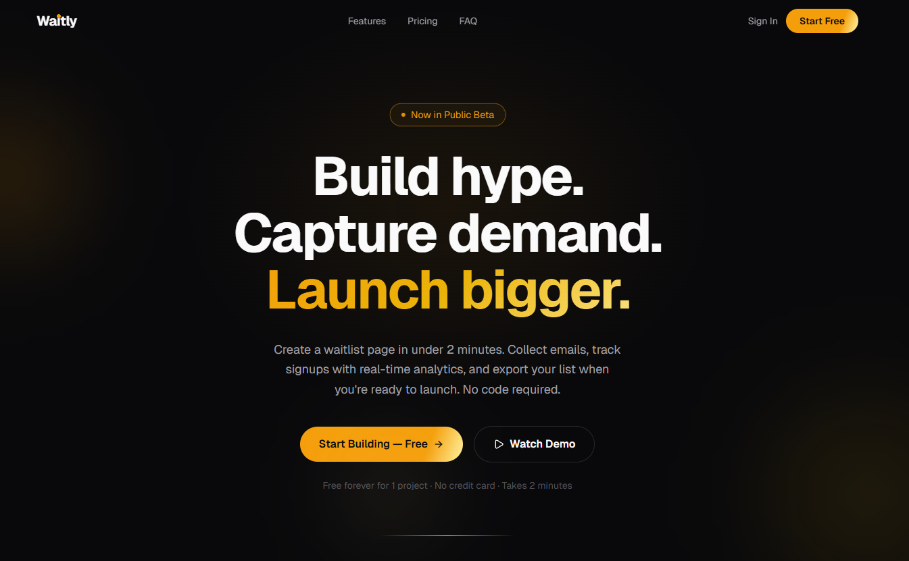
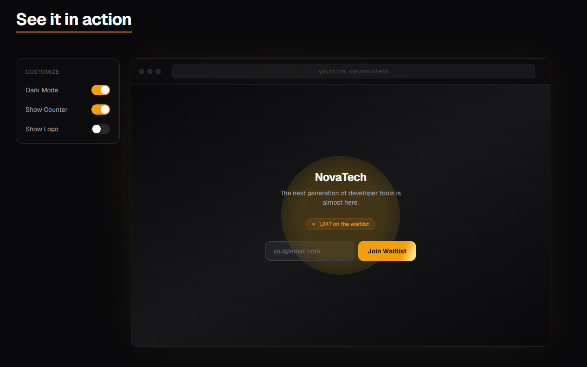
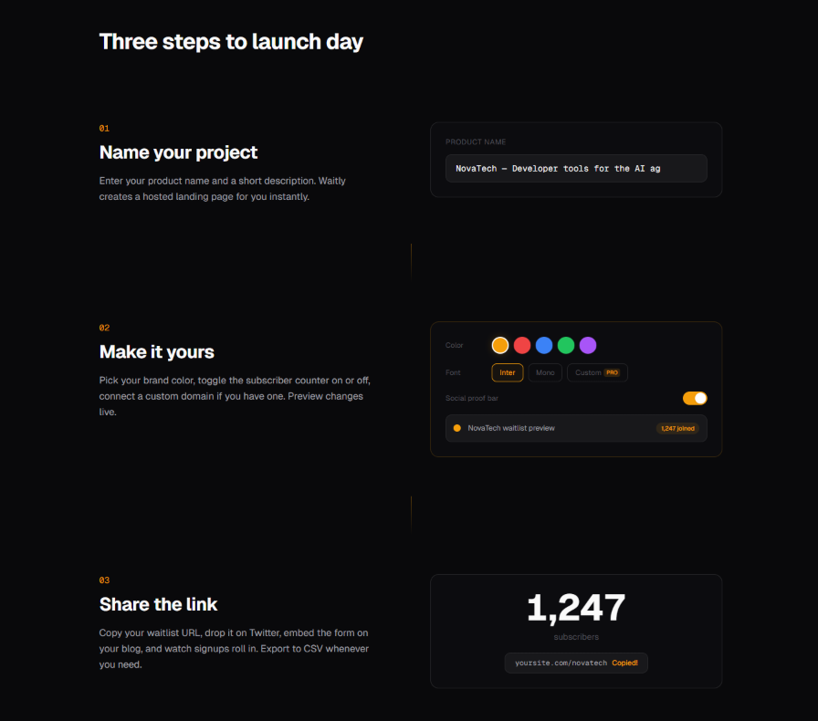
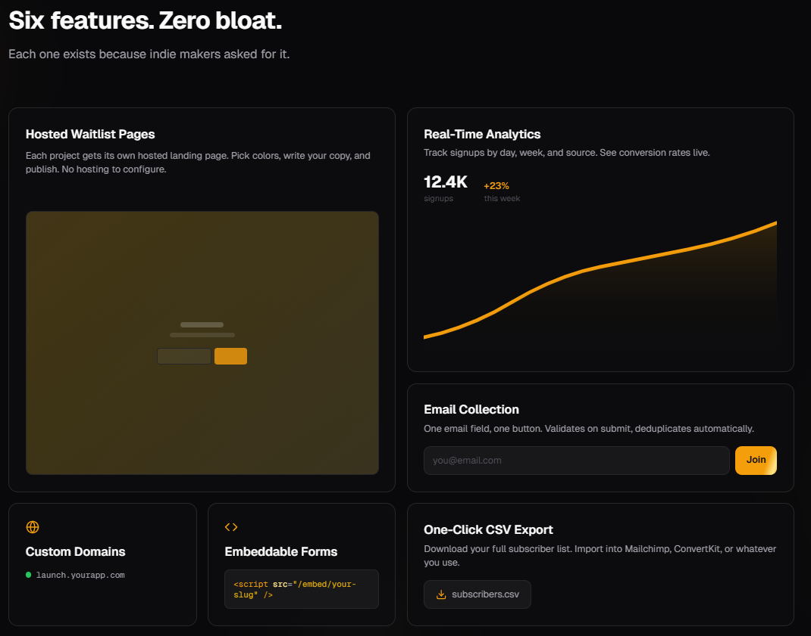
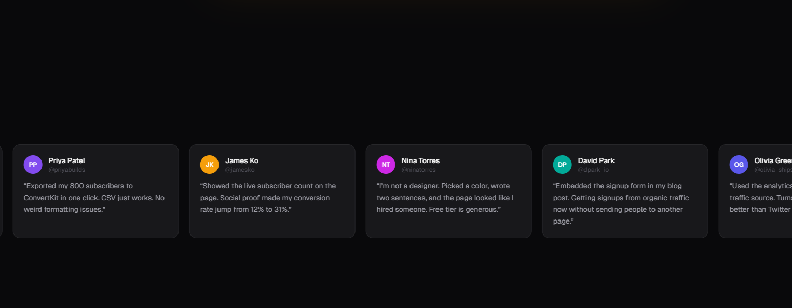
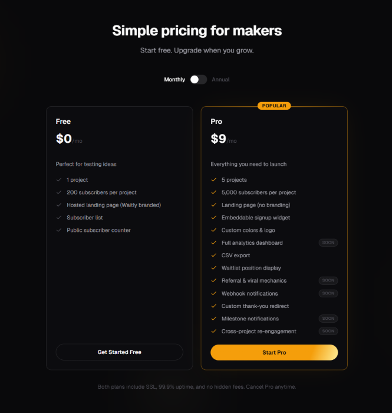
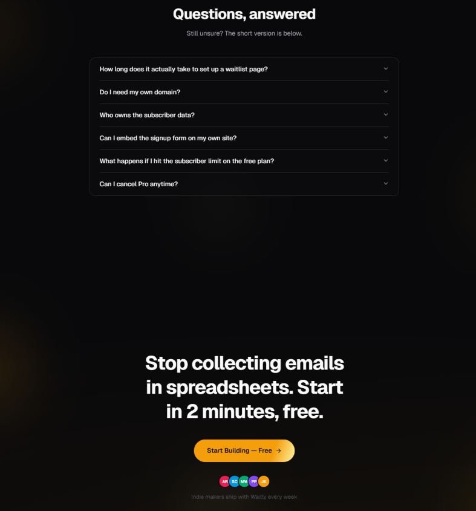

<p align="center">
  
  
  
  
  
  
  
  
</p>

<h1 align="center">Waitly</h1>

<p align="center">
  <strong>Build hype. Capture demand. Launch bigger.</strong>
  <br />
  A hosted waitlist SaaS for indie makers — landing page, embeddable form, real signups, CSV export.
</p>

<p align="center">
  <a href="https://waitly-blush.vercel.app"><strong>Live demo →</strong></a>
  &nbsp;&middot;&nbsp;
  <a href="#screenshots">Screenshots</a>
  &nbsp;&middot;&nbsp;
  <a href="#features">Features</a>
  &nbsp;&middot;&nbsp;
  <a href="#tech-stack">Tech stack</a>
  &nbsp;&middot;&nbsp;
  <a href="#architecture-notes">Architecture notes</a>
</p>

---

<p align="center">
  
</p>

## What this is

A working SaaS for indie makers who want to validate demand before building. Sign up, create a project, share the URL, watch emails come in, export the list when you're ready to launch.

This repo is also a **portfolio piece** — full-stack Next.js 16 + Auth.js v5 + Prisma + Postgres, deployed end-to-end on Vercel with branch-per-preview Neon databases. Source code lives in a private repo; this README is the case study.

> **Status:** Public beta. Free tier live. Stripe billing, custom domains, and webhook notifications planned next.

---

## Screenshots

### Interactive product preview
The marketing page ships a live customizer so visitors can toggle dark mode, the subscriber counter, and the logo on a mock waitlist page before they even sign up.

<p align="center">
  
</p>

### Three steps to launch day
Name your project. Pick a color and toggle social proof. Share the link.

<p align="center">
  
</p>

### Six features. Zero bloat.
Hosted pages, real-time analytics, email collection, custom domains, embeddable forms, one-click CSV export.

<p align="center">
  
</p>

### Social proof
A horizontal carousel of indie-maker testimonials sits between the feature grid and pricing.

<p align="center">
  
</p>

### Simple pricing
Free forever for one project. Pro at $9/mo when you need more.

<p align="center">
  
</p>

### FAQ + closing CTA

<p align="center">
  
</p>

---

## Features

| Feature | Status |
| --- | :---: |
| Email + password signup with email verification | ✅ |
| Google + GitHub OAuth | ✅ |
| Password reset (token-based, expiring links via Resend) | ✅ |
| Project CRUD — custom slug, accent color, optional logo URL | ✅ |
| Hosted public waitlist page at `/<slug>` | ✅ |
| One-line embeddable widget at `/api/embed/<slug>/embed.js` | ✅ |
| Live subscriber counter on public page | ✅ |
| Subscriber list view + CSV export | ✅ |
| 7-day signup sparkline | ✅ |
| Account management — change email, change password, export data, delete account | ✅ |
| Honeypot bot defense + IP-hashed rate limiting on subscribe | ✅ |
| Mobile-responsive dashboard with sheet drawer nav | ✅ |
| Security headers (CSP, HSTS, X-Frame-Options, Referrer-Policy, Permissions-Policy) | ✅ |
| Stripe billing | ⏳ planned |
| Custom domains for hosted pages | ⏳ planned |
| Webhook notifications on subscriber milestones | ⏳ planned |

---

## Tech stack

| Layer | Choice |
| --- | --- |
| Framework | Next.js 16 (App Router, React 19, React Compiler) |
| Language | TypeScript (strict mode) |
| Styling | Tailwind CSS 4 + shadcn/ui (scoped Radix primitives) |
| Animations | `motion` (Framer Motion v12) |
| Database | PostgreSQL via Neon |
| ORM | Prisma 7 with `@prisma/adapter-pg` driver adapter |
| Auth | Auth.js v5 (JWT sessions, credentials + Google + GitHub) |
| Email | Resend (verification + password reset only) |
| Validation | Zod (every API boundary + every form) |
| Toasts | Sonner |
| Icons | Lucide |
| Tests | Vitest — 30 tests passing |
| CI | GitHub Actions (lint + test + build) |
| Hosting | Vercel (frontend + API routes) |

**Vendor count: 5** — Vercel, Neon, Resend, Google OAuth, GitHub OAuth. No Stripe, no Sentry, no Upstash, no Turnstile. Deliberately small surface area until the product warrants more.

---

## Architecture notes

A few decisions worth a closer look — the *why* behind each choice:

- **JWT sessions over DB sessions.** No `Session` table — every request decodes a signed cookie. Cheap reads, no DB hop on auth checks. Tradeoff: revocation requires a `tokenVersion` field (not implemented; acceptable for the current trust model).
- **In-memory rate limiter.** A `Map` in `src/lib/rate-limit.ts`. Fine for single-instance dev and the showcase deploy; on multi-instance serverless it limits per function instance, not globally. Documented upgrade path: drop in `@upstash/ratelimit` with the same call signature.
- **Honeypot instead of CAPTCHA.** A hidden `hp` field on the subscribe form. Filled = silent 200, no DB write. Cheaper, no external script, no per-request network call, no user friction. Won't stop a determined attacker but neutralizes mass form-spam bots.
- **Prisma driver adapter.** `PrismaPg` from `@prisma/adapter-pg` instead of the bundled binary. Connection string is normalized in `src/lib/db.ts` to opt into libpq SSL semantics (silences the pg-connection-string deprecation warning on Neon).
- **Per-PR Neon database branches.** `vercel-build` runs `prisma migrate deploy && next build`; each preview gets its own database branch via the Neon Vercel integration.
- **Native form + Zod over react-hook-form.** Project create/edit form is plain `useState` + `safeParse` on submit. Less ceremony, smaller bundle, equivalent validation surface.
- **Dark only.** No theme toggle. One CSS variable set, less to test, less to maintain.

---

## Testing

Vitest, 30 tests passing. Coverage is concentrated on the bits that fail silently if regressed:

- Rate-limit utilities — window expiry, per-key isolation, header parsing
- Zod validators — slug rules, reserved slug list, hex color, safe URL redirect

Lint + test + build run on every push via GitHub Actions.

---

## Project structure

```
src/
├── app/
│   ├── (marketing)/              Landing page, privacy, terms
│   ├── (auth)/                   Login, signup, forgot/reset password
│   ├── (dashboard)/              Protected app routes (project list, detail, account)
│   ├── [slug]/                   Public waitlist page
│   ├── embed/[slug]/             Iframe-friendly embed page
│   ├── api/                      All API routes (auth, projects, public subscribe, etc.)
│   ├── layout.tsx                Root layout
│   └── globals.css               Tailwind config + design tokens + keyframes
│
├── components/
│   ├── ui/                       shadcn primitives
│   ├── layout/                   Logo, navbar, footer
│   ├── marketing/                Hero, features, pricing, FAQ, CTA, background orbs
│   ├── forms/                    Login, signup, forgot/reset password
│   ├── public/                   Subscribe form (used by hosted page + embed)
│   ├── dashboard/                Project card, stats card, subscriber table
│   └── account/                  Change email, change password, delete, export
│
├── hooks/                        useSubscription
├── lib/                          db, auth, validators, email, tokens, rate-limit, site
├── proxy.ts                      Next.js 16 middleware (route protection)
└── lib/__tests__/                Vitest specs
```

---

## Roadmap

In roughly the order they'd ship:

1. **Stripe subscriptions** + Pro tier feature gating
2. **Distributed rate limiter** (Upstash) for real public launch
3. **Custom domains** for hosted waitlist pages
4. **Webhook notifications** on subscriber milestones

---

## License

MIT — see [LICENSE](./LICENSE).

---

<p align="center">
  <strong>Built for indie makers who validate before they build.</strong>
  <br />
  <a href="https://waitly-blush.vercel.app">waitly-blush.vercel.app</a>
</p>
